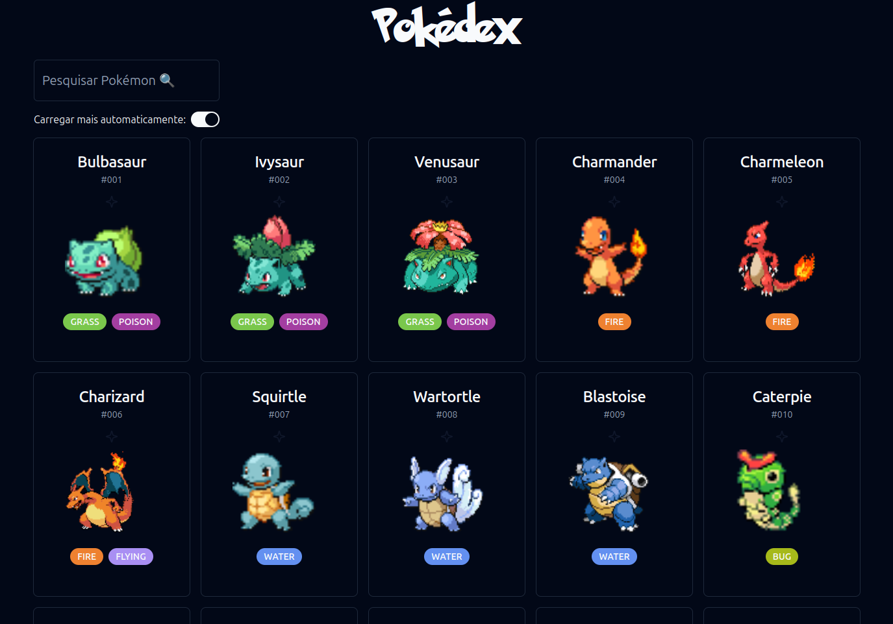

<h1  align="center">Shad Pokedex</h1>

  Uma pokedex simples feita por um iniciante que não entende muito de front end.

Projeto construído com [React](https://react.dev/), [shadcn/ui](https://ui.shadcn.com/) e [PokeAPI](https://pokeapi.co/)

Preview:

    

### Veja funcionando
[Shad Pokedex 🔗](https://shadpokedex.netlify.app/)
